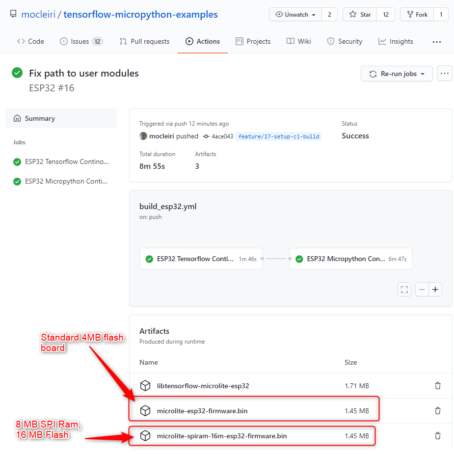

# Tensorflow Lite for Microcontrollers in Micropython

The purpose of this project is to make a custom micropython firmware that installs tensorflow lite for micro controllers and allows for experimentation.

## Architecture

This project is a micropython module built using the USER_C_MODULES extension mechanism.  There are two modules:
* microlite
* ulab

There are 3 git submodules:
* tensorflow lite micro
* micropython
* ulab


tflite-micro sources are generated within the microlite module at build time using the tensorflow lite example generator.

The microlite module has several types:
* tensor
* interpreter
* audio_frontend (used for the micro_speech example)

# Port Status

Build Type | Status |
 --------- | ------ |
ESP32   | [](https://github.com/mocleiri/tensorflow-micropython-examples/actions/workflows/build_esp32.yml) |
ESP32 S3   | [](https://github.com/mocleiri/tensorflow-micropython-examples/actions/workflows/build_esp32s3.yml) |
RP2     | [](https://github.com/mocleiri/tensorflow-micropython-examples/actions/workflows/build_rp2.yml) |
STM32   | [](https://github.com/mocleiri/tensorflow-micropython-examples/actions/workflows/build_stm32.yml) |
UNIX   | [](https://github.com/mocleiri/tensorflow-micropython-examples/actions/workflows/build_unix.yml) |

# Recent Changes

## Build Process Changed

[#36](https://github.com/mocleiri/tensorflow-micropython-examples/issues/36) moved the audio_frontend from a seperate module into a type within the microlite module.

# Roadmap

## Merge audio_frontend into microlite module

For CircuitPython we need to put all our stuff into a single module.  The latest builds support more
platforms but don't yet the support the audio frontend.

Tracked in #36 and #37.

## STM32 H743 Port Broken

For unknown reasons when I try to run the hello world example on my Nucleo H743ZI2 the board
resets.

Tracked by [#31](https://github.com/mocleiri/tensorflow-micropython-examples/issues/31)


# Prebuilt Firmware

The latest firmware can be downloaded from the applicable build above (in the Status section).
1. Click on build status link.
2. Click on the latest green build
3. Review the available artifacts for download

You do need to be careful to get the proper firmware for your board.  If your board is not currently being built please file an issue and it can be added.



# Examples

## Hello World

Give a model an x value and it will give a y value.  The chart of such points is an approximate sine wave:


Status:
* Works on unix port and esp32 port.

[Hello-World Documentation](examples/hello-world/README.md)

## Micro Speech 

Process:
1. Sample Audio
2. Convert to spectrogram
3. Set 1960 bytes on input tensor corresponding to 1 second worth of spectrogram.
4. Run inference on model 3-4 times per second and average scores.
5. Scores over 200 indicate a match

Status:
* Works on unix port with files.
* Works on esp32 no-spi ram board with machine.I2S.

[Micro Speech Documentation](examples/micro-speech/README.md)

## Person Detection

Process:
1. Capture Images
2. Convert to 96x96 pixel int8 greyscale images
3. Set on input later of model
4. Run inference on image
5. if person > no person it thinks the image is a person
6. if no person > person it thinks the image contains no person

Status:
* Works on unix port and esp32 port using files.

[Person Detection Documentation](examples/person_detection/README.md)

## Magic Wand

[TODO #5](https://github.com/mocleiri/tensorflow-micropython-examples/issues/5)

# Roadmap

Almost all of the examples work now.

| # | Description | Issue |
| --- | --- | --- |
| 1. | Adjust microlite api to match tflite python api (at least a subset).  We don't really need the callback approach anymore. |  https://github.com/mocleiri/tensorflow-micropython-examples/issues/10 |
| 2. | Cleanup micro_speech implementation | |
| 3. | Implement the magic wand example | https://github.com/mocleiri/tensorflow-micropython-examples/issues/5 |
| 4. | Investigate automatic tensor quantization | https://github.com/mocleiri/tensorflow-micropython-examples/issues/6 |
| 5. | Find way to externalize tensor op's from firmware | https://github.com/mocleiri/tensorflow-micropython-examples/issues/7 |

# About Tensorflow

At the moment we are using the main branch in the tensorflow lite micro repository.

This is the c++ api version of tensorflow lite designed to run on microcontrollers.

At the moment we are building everything and linking it into the micropython firmware.

The next steps are to try and find ways to use build switches or native modules to support
smaller firmware sizes.

# About Micropython

We are building from micropython master.  

# How to Build

Normally you can just download the precompiled firmware.  If you want to know how to build it yourself
then consult the [Build Documentation](BUILD.md).

# Flash image

ESP32D0WDQ6 4MB Flash

Download the firmware from the latest ci build.

The zip file contains:
1. The bootloader
2. The partition table
3. The firmware

```
 esptool.py -p COM5 -b 460800 --before default_reset --after hard_reset --chip esp32 write_flash --flash_mode dio --flash_size detect --flash_freq 40m 0x1000 bootloader/bootloader.bin 0x8000 partition_table/partition-table.bin 0x10000 micropython.bin
```


# Credits

As far as I am aware OpenMV (https://openmv.io/) was the first micropython firmware to support tensorflow.  

I copied extensively from their approach to get inference working in the hello world example and also for micro-speech example.

I started from their libtf code for how to interact with the Tensorflow C++ API from micropython:

https://github.com/openmv/tensorflow-lib/blob/343fe84c97f73d2fe17a0ed23540d06c782fafe7/libtf.cc
and
https://github.com/openmv/tensorflow-lib/blob/343fe84c97f73d2fe17a0ed23540d06c782fafe7/libtf.h 

The audio-frontend module originated by looking at how openmv connected to the tensorflow microfrontend here:
https://github.com/openmv/openmv/blob/3d9929eeae563c5b370ac86afa9216df50f0c079/src/omv/ports/stm32/modules/py_micro_speech.c
